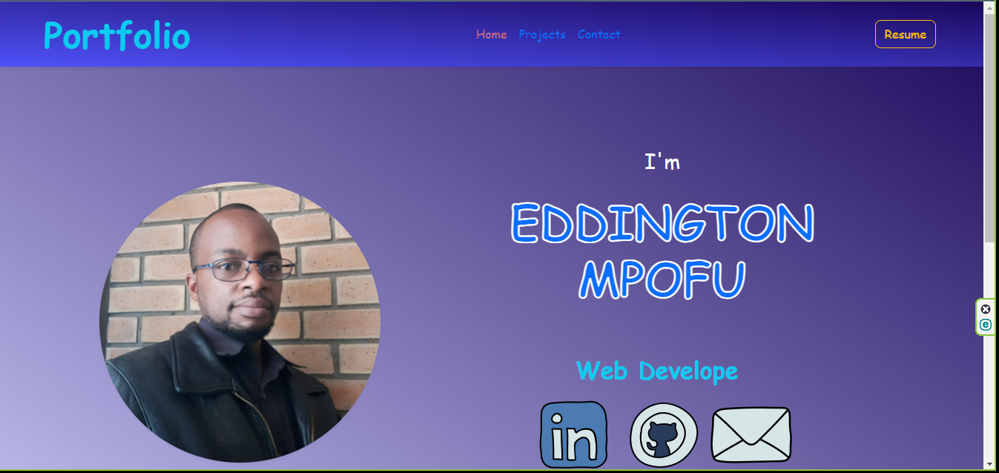

# Eddington-react-portfolio

## Description 
This project is a single-page application using React.js to dynamically render content to create a portfolio that includes "Home"(Landing Page), "Contact", "Resume", and "Projects" pages. Take a look at my work through my portfolio page and get to know me a who I am and get in touch, I would love to collaborate! Download my resume to view my work experience and where to contact me.

## Table of Contents
* [Installation](#installation)
* [Usage](#usage)
* [License](#license)
* [Contributing](#contributing)
* [Tests](#tests)
* [Questions](#questions)

## Installation 
The user should clone the repository from GitHub and install dependencies. To run React, run `npm run dev`. 

## Usage 
This application will allow users view a brief summary of my work and my resume. 
Please view deployed application on [Git Hub Pages](https://eampofu.github.io/Eddington-react-portfolio/) 

## License 
This project is license under MIT

## Contributing 
Contributors should read the installation section. 

## Tests
No tests where implemented for this application. 

## Questions

If you have any questions about this projects, please contact me directly at eampofu@gmail. You can view more of my projects at [ GitHub](https://github.com/eampofu)
&nbsp;
[ Linkedin](https://www.linkedin.com/in/eampofu)

